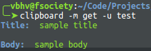

# clipboard :clipboard:
#### This is a CLI pastebin. (Well CLI and Web eventually..)

# What are the Components
* A [REST API](https://github.com/vbhv007/clipboard-API) built with flask which deals with the MongoDB database stuff.
* A cli python app which users can use to do certain tasks if only they want to do it. (Seriously no pressure here..).
* A web frontend which I'm hoping to write in Angular coz why not?

# How do I install it

### Well short answer, with the `install.sh` Magic Wand
First of all download the repo or clone it. Then
```
chmod +x install.sh
./install.sh
```
 And then you may delete the repo.

 # Ok I installed it now how to use it
 ### Here's a basic example
```
clipboard -m get -u test
```
or 
```
clipboard --method get --url test
```
and it will return something like this




#### Checkout [DOCS](DOCS.md) for more

# I want to Contribute
### Things you can do to contribute
* Fork it, Make new branch, Add new code, Make a PR.
* Find bugs :smiling_imp:. Report them [here](https://github.com/vbhv007/clipboard/issues).
* Suggest new features from [here](https://github.com/vbhv007/clipboard/issues).
* Write DOCS (plz plz plzz do this.. :sob:).

